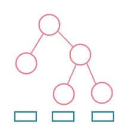

<p align="center">
  
  <h1>Langlib</h1>
</p>

[](https://github.com/nielstron/langlib/actions/workflows/build.yml)

`Langlib` is a Lean 4 library of formalized results from formal language theory, defining and relating various grammars, language classes, and automata across the Chomsky hierarchy and beyond.

📖 **Documentation:** [overview](https://nielstron.github.io/langlib/) · [API reference](https://nielstron.github.io/langlib/api/)


## Proof overview
The goal of this library is to encapsulate some core results of the (extended) Chomsky hierarchy: inclusions, closures and decidability.
The following gives a rough overview over the contents in highly condensed form.

The tables contain standard results. `🔗` indicates that the linked file
contains a corresponding definition or theorem stated explicitly for the displayed
language or presentation classes.
More detailed results and developed tooling (e.g., Pumping lemmas, Totalizations) can be found in the [documentation](https://nielstron.github.io/langlib/).

### Hierarchy And Equivalences

Each class of the (extended) hierarchy is characterized as a grammar or automaton
(or both, and variants thereof). We show (strict) inclusions of the classes and
equivalences between different characterizations.

In an inclusion row, a link is attached only when the cited file states a theorem
explicitly for the language or presentation classes displayed in that column. The
proof may use established equivalences. Parenthesized `⊆` links record a proved
weaker inclusion when the displayed strict result is not yet formalized for those
classes.

| Class Name | Grammar | Relation | Automaton |
| --- | --- | --- | --- |
| Regular | Regular (Left-regular [🔗](src/Langlib/Grammars/LeftRegular/Definition.lean) ⇔[🔗](src/Langlib/Grammars/LeftRegular/Equivalence/RightRegular.lean) Right-regular [🔗](src/Langlib/Grammars/RightRegular/Definition.lean)) | ⇔ [🔗](src/Langlib/Automata/FiniteState/Equivalence/Regular.lean)| Finite Automata [🔗](src/Langlib/Automata/FiniteState/Definition.lean) (NFA ⇔ [🔗](src/Langlib/Automata/FiniteState/Equivalence/Determinization.lean) DFA) |
| | ⊊ [🔗](src/Langlib/Classes/Regular/Inclusion/StrictLR.lean) |  | ⊊ [🔗](src/Langlib/Automata/FiniteState/Inclusion/StrictDeterministicPushdown.lean) |
| Deterministic context-free | LR(k), `k > 0` [🔗](src/Langlib/Grammars/LR/Definition.lean) | ⇔ [🔗](src/Langlib/Grammars/LR/Equivalence.lean) | Deterministic Pushdown Automata [🔗](src/Langlib/Automata/DeterministicPushdown/Definition.lean) |
| | ⊊ [🔗](src/Langlib/Grammars/LR/Inclusion/StrictContextFree.lean) |  | ⊊ [🔗](src/Langlib/Automata/DeterministicPushdown/Inclusion/StrictPushdown.lean) |
| Context-free | Context-free [🔗](src/Langlib/Grammars/ContextFree/Definition.lean) | ⇔ [🔗](src/Langlib/Automata/Pushdown/Equivalence/ContextFree.lean) | Pushdown Automata [🔗](src/Langlib/Automata/Pushdown/Definition.lean) (Final State ⇔ [🔗](src/Langlib/Automata/Pushdown/Basics/FinalStateEmptyStack.lean) Empty Stack) |
| | ⊊ [🔗](src/Langlib/Classes/ContextFree/Inclusion/StrictIndexed.lean) (⊊ CS [🔗](src/Langlib/Classes/ContextFree/Inclusion/StrictContextSensitive.lean))|  | ⊊ |
| Indexed | Indexed [🔗](src/Langlib/Grammars/Indexed/Definition.lean) | ⇔ | Nested Stack Automata |
| | ⊊ [🔗](src/Langlib/Classes/Indexed/Inclusion/StrictContextSensitive.lean) |  | ⊊ |
| Context-sensitive | Context-sensitive [🔗](src/Langlib/Grammars/ContextSensitive/Definition.lean) (Non-erasing ⇔ [🔗](src/Langlib/Grammars/NonContracting/Equivalence/ContextSensitiveGeneral.lean) Non-contracting [🔗](src/Langlib/Grammars/NonContracting/Definition.lean)) | ⇔ [🔗](src/Langlib/Automata/LinearBounded/Equivalence/ContextSensitive.lean) | Linear Bounded Automaton [🔗](src/Langlib/Automata/LinearBounded/Definition.lean) (DLBA [🔗](src/Langlib/Automata/DeterministicLinearBounded/Definition.lean) ⇔? NLBA (⊆ [🔗](src/Langlib/Automata/DeterministicLinearBounded/Inclusion/LinearBounded.lean))) |
|  |  |  | ⊊ [🔗](src/Langlib/Automata/LinearBounded/Inclusion/Recursive.lean) |
| Recursive |  ⊊ [🔗](src/Langlib/Classes/ContextSensitive/Inclusion/StrictRecursive.lean) (⊆ [🔗](src/Langlib/Classes/ContextSensitive/Inclusion/Recursive.lean)) | | Turing-machines with halting deciders [🔗](src/Langlib/Classes/Recursive/Definition.lean) |
|  |  |  | ⊊ [🔗](src/Langlib/Classes/Recursive/Inclusion/StrictRecursivelyEnumerable.lean)  |
| Recursively Enumerable | Unrestricted [🔗](src/Langlib/Grammars/Unrestricted/Definition.lean) | ⇔ [🔗](src/Langlib/Automata/Turing/Equivalence/RecursivelyEnumerable.lean) | Turing-machines [🔗](src/Langlib/Automata/Turing/Definition.lean) |

The `DLBA ⇔? NLBA` entry is the **first LBA problem**, which remains open:
in complexity terminology it asks whether deterministic and nondeterministic
linear space have the same power.  Langlib proves the easy `DLBA ⊆ NLBA`
direction above and the machine-level converse for an NLBA whose transition
relation is already single-valued
[🔗](src/Langlib/Automata/LinearBounded/Functional.lean).  The
Immerman–Szelepcsényi complement construction does not settle this question:
it constructs another nondeterministic linear-space machine rather than a
deterministic one.  The reverse inclusion is equivalent to deterministic
reachability for finite fixed-width row systems even when their local edge
verifier is deterministic, the row graph is acyclic, and every row has both
indegree and outdegree at most two
[🔗](src/Langlib/Automata/LinearBounded/CertifiedRowSystem/StrictDegreeCharacterization.lean).
At the machine level, every LBA also has an equivalent presentation whose
configuration graph has both directed degrees at most two
[🔗](src/Langlib/Automata/LinearBounded/BoundedDegree.lean).  A guarded
same-width clock compiler strengthens this to a globally acyclic
presentation, and the degree serializers preserve that property.  Thus even
globally acyclic configuration graphs of indegree and outdegree at most two
recognize exactly `LBA`
[🔗](src/Langlib/Automata/LinearBounded/AcyclicClock/LanguageEquivalence.lean).
This is a nondeterministic normal form, not a DLBA construction.
The [first-LBA boundary note](docs/results/first-lba-problem-boundaries.md)
records the exact equivalences, restricted positive cases, failed proof
routes, and current literature status.

The strict hierarchy results are uniform over every finite alphabet meeting the
displayed result's sharp or currently proved size bound: Regular ⊊ LR(k)/DPDA
requires at least two symbols; LR(k)/DPDA ⊊ CF, CF ⊊ Indexed, and CF ⊊ CS
are proved for at least three; Indexed ⊊ CS requires at least two; and the
strict inclusions CS/LBA ⊊ Recursive, CS ⊊ RE, and Recursive ⊊ RE require
a nonempty alphabet.
The underlying inclusion Indexed ⊆ CS
[🔗](src/Langlib/Classes/Indexed/Inclusion/ContextSensitive.lean) holds over every
terminal type.

**Additional results**

- Context Free Languages ⇔ [🔗](src/Langlib/Grammars/ContextFree/MathlibCFG.lean) Mathlib's `IsContextFree`.
- Regular ⊊ [🔗](src/Langlib/Classes/Regular/Inclusion/StrictLinear.lean) Linear ⊊ [🔗](src/Langlib/Classes/Linear/Inclusion/StrictContextFree.lean) Context-free.
- Regular ⊆ [🔗](src/Langlib/Classes/Regular/Inclusion/Recursive.lean) Recursive.
- Context-free ⊆ [🔗](src/Langlib/Classes/ContextFree/Inclusion/Recursive.lean) Recursive.

### Closure

We define abstract closure predicates (`ClosedUnderUnion`, `ClosedUnderHomomorphism`, etc.) for uniform proofs in [🔗](src/Langlib/Utilities/ClosurePredicates.lean).

| Operation | Regular | DCFL | CFL | IND | CSL | Recursive | RE |
| --- | --- | --- | --- | --- | --- | --- | --- |
| Union | Yes [🔗](src/Langlib/Classes/Regular/Closure/Union.lean) | No [🔗](src/Langlib/Classes/DeterministicContextFree/Closure/Union.lean) | Yes [🔗](src/Langlib/Classes/ContextFree/Closure/Union.lean) | Yes [🔗](src/Langlib/Classes/Indexed/Closure/Union.lean) | Yes [🔗](src/Langlib/Classes/ContextSensitive/Closure/Union.lean) | Yes [🔗](src/Langlib/Classes/Recursive/Closure/Union.lean) | Yes [🔗](src/Langlib/Classes/RecursivelyEnumerable/Closure/Union.lean) |
| Intersection | Yes [🔗](src/Langlib/Classes/Regular/Closure/Intersection.lean) | No [🔗](src/Langlib/Classes/DeterministicContextFree/Closure/Intersection.lean) | No [🔗](src/Langlib/Classes/ContextFree/Closure/Intersection.lean) | No [🔗](src/Langlib/Classes/Indexed/Closure/Intersection.lean) | Yes [🔗](src/Langlib/Classes/ContextSensitive/Closure/Intersection.lean) | Yes [🔗](src/Langlib/Classes/Recursive/Closure/Intersection.lean) | Yes [🔗](src/Langlib/Classes/RecursivelyEnumerable/Closure/Intersection.lean) |
| Complement | Yes [🔗](src/Langlib/Classes/Regular/Closure/Complement.lean) | Yes [🔗](src/Langlib/Classes/DeterministicContextFree/Closure/Complement.lean) | No [🔗](src/Langlib/Classes/ContextFree/Closure/Complement.lean) | No [🔗](src/Langlib/Classes/Indexed/Closure/Complement.lean) | Yes [🔗](src/Langlib/Classes/ContextSensitive/Closure/Complement.lean) | Yes [🔗](src/Langlib/Classes/Recursive/Closure/Complement.lean) | No [🔗](src/Langlib/Classes/RecursivelyEnumerable/Closure/Complement.lean) |
| Concatenation | Yes [🔗](src/Langlib/Classes/Regular/Closure/Concatenation.lean) | No [🔗](src/Langlib/Classes/DeterministicContextFree/Closure/Concatenation.lean) | Yes [🔗](src/Langlib/Classes/ContextFree/Closure/Concatenation.lean) | Yes [🔗](src/Langlib/Classes/Indexed/Closure/Concatenation.lean) | Yes [🔗](src/Langlib/Classes/ContextSensitive/Closure/Concatenation.lean) | Yes [🔗](src/Langlib/Classes/Recursive/Closure/Concatenation.lean) | Yes [🔗](src/Langlib/Classes/RecursivelyEnumerable/Closure/Concatenation.lean) |
| Kleene star | Yes [🔗](src/Langlib/Classes/Regular/Closure/Star.lean) | No [🔗](src/Langlib/Classes/DeterministicContextFree/Closure/Star.lean) | Yes [🔗](src/Langlib/Classes/ContextFree/Closure/Star.lean) | Yes [🔗](src/Langlib/Classes/Indexed/Closure/Star.lean) | Yes [🔗](src/Langlib/Classes/ContextSensitive/Closure/Star.lean) | Yes [🔗](src/Langlib/Classes/Recursive/Closure/Star.lean) | Yes [🔗](src/Langlib/Classes/RecursivelyEnumerable/Closure/Star.lean) |
| (String) homomorphism | Yes [🔗](src/Langlib/Classes/Regular/Closure/Homomorphism.lean) | No [🔗](src/Langlib/Classes/DeterministicContextFree/Closure/Homomorphism.lean) | Yes [🔗](src/Langlib/Classes/ContextFree/Closure/Homomorphism.lean) | Yes [🔗](src/Langlib/Classes/Indexed/Closure/Homomorphism.lean) | No [🔗](src/Langlib/Classes/ContextSensitive/Closure/Homomorphism.lean) | No [🔗](src/Langlib/Classes/Recursive/Closure/Homomorphism.lean) | Yes [🔗](src/Langlib/Classes/RecursivelyEnumerable/Closure/Homomorphism.lean) |
| `ε`-free (string) homomorphism | Yes [🔗](src/Langlib/Classes/Regular/Closure/Homomorphism.lean) | No [🔗](src/Langlib/Classes/DeterministicContextFree/Closure/Homomorphism.lean) | Yes [🔗](src/Langlib/Classes/ContextFree/Closure/Homomorphism.lean) | Yes [🔗](src/Langlib/Classes/Indexed/Closure/Homomorphism.lean) | Yes [🔗](src/Langlib/Classes/ContextSensitive/Closure/EpsFreeHomomorphism.lean) | Yes [🔗](src/Langlib/Classes/Recursive/Closure/EpsFreeHomomorphism.lean) | Yes [🔗](src/Langlib/Classes/RecursivelyEnumerable/Closure/Homomorphism.lean) |
| Substitution | Yes [🔗](src/Langlib/Classes/Regular/Closure/Substitution.lean) | No [🔗](src/Langlib/Classes/DeterministicContextFree/Closure/Substitution.lean) | Yes [🔗](src/Langlib/Classes/ContextFree/Closure/Substitution.lean) | Yes [🔗](src/Langlib/Classes/Indexed/Closure/Substitution.lean) | No [🔗](src/Langlib/Classes/ContextSensitive/Closure/Substitution.lean) | No [🔗](src/Langlib/Classes/Recursive/Closure/Substitution.lean) | Yes [🔗](src/Langlib/Classes/RecursivelyEnumerable/Closure/Substitution.lean) |
| Inverse homomorphism | Yes [🔗](src/Langlib/Classes/Regular/Closure/InverseHomomorphism.lean) | Yes [🔗](src/Langlib/Classes/DeterministicContextFree/Closure/InverseHomomorphism.lean) | Yes [🔗](src/Langlib/Classes/ContextFree/Closure/InverseHomomorphism.lean) | Yes [🔗](src/Langlib/Classes/Indexed/Closure/InverseHomomorphism.lean) | Yes [🔗](src/Langlib/Classes/ContextSensitive/Closure/InverseHomomorphism.lean) | Yes [🔗](src/Langlib/Classes/Recursive/Closure/InverseHomomorphism.lean) | Yes [🔗](src/Langlib/Classes/RecursivelyEnumerable/Closure/InverseHomomorphism.lean) |
| Reverse | Yes [🔗](src/Langlib/Classes/Regular/Closure/Reverse.lean) | No [🔗](src/Langlib/Classes/DeterministicContextFree/Closure/Reverse.lean) | Yes [🔗](src/Langlib/Classes/ContextFree/Closure/Reverse.lean) | Yes [🔗](src/Langlib/Classes/Indexed/Closure/Reverse.lean) | Yes [🔗](src/Langlib/Classes/ContextSensitive/Closure/Reverse.lean) | Yes [🔗](src/Langlib/Classes/Recursive/Closure/Reverse.lean) | Yes [🔗](src/Langlib/Classes/RecursivelyEnumerable/Closure/Reverse.lean) |
| Intersection with a regular language | Yes [🔗](src/Langlib/Classes/Regular/Closure/Intersection.lean) | Yes [🔗](src/Langlib/Classes/DeterministicContextFree/Closure/IntersectionRegular.lean)| Yes [🔗](src/Langlib/Classes/ContextFree/Closure/IntersectionRegular.lean) | Yes [🔗](src/Langlib/Classes/Indexed/Closure/IntersectionRegular.lean) | Yes [🔗](src/Langlib/Classes/ContextSensitive/Closure/IntersectionRegular.lean) | Yes [🔗](src/Langlib/Classes/Recursive/Closure/IntersectionRegular.lean) | Yes [🔗](src/Langlib/Classes/RecursivelyEnumerable/Closure/Intersection.lean) |
| Right quotient | Yes [🔗](src/Langlib/Classes/Regular/Closure/Quotient.lean) | No [🔗](src/Langlib/Classes/DeterministicContextFree/Closure/Quotient.lean) | No [🔗](src/Langlib/Classes/ContextFree/Closure/Quotient.lean) | No [🔗](src/Langlib/Classes/Indexed/Closure/Quotient.lean) | No [🔗](src/Langlib/Classes/ContextSensitive/Closure/Quotient.lean) | No [🔗](src/Langlib/Classes/Recursive/Closure/Quotient.lean) | Yes [🔗](src/Langlib/Classes/RecursivelyEnumerable/Closure/Quotient.lean) |
| Right quotient with a regular language | Yes [🔗](src/Langlib/Classes/Regular/Closure/Quotient.lean) | Yes [🔗](src/Langlib/Classes/DeterministicContextFree/Closure/QuotientRegular.lean) | Yes [🔗](src/Langlib/Classes/ContextFree/Closure/Quotient.lean) | Yes [🔗](src/Langlib/Classes/Indexed/Closure/QuotientRegular.lean) | No [🔗](src/Langlib/Classes/ContextSensitive/Closure/QuotientRegular.lean) | No [🔗](src/Langlib/Classes/Recursive/Closure/QuotientRegular.lean) | Yes [🔗](src/Langlib/Classes/RecursivelyEnumerable/Closure/Quotient.lean) |

For a negative closure entry, `No` means that closure fails over some finite
alphabet; it does not claim failure over every alphabet.  The linked files expose
embedding/cardinality variants (for example, `_of_embedding` and `_of_card`) giving
the proved sufficient alphabet-size bounds.  Positive entries are stated uniformly
over the finite alphabet assumptions required by their definitions.


Additional DCFL results:

- [Union with a regular language](src/Langlib/Classes/DeterministicContextFree/Closure/UnionRegular.lean)

Additional CFL results:

- [Terminal bijections](src/Langlib/Classes/ContextFree/Closure/Bijection.lean)
- [Terminal permutations](src/Langlib/Classes/ContextFree/Closure/Permutation.lean)
- [Prefix](src/Langlib/Classes/ContextFree/Closure/Prefix.lean)
- [Suffix](src/Langlib/Classes/ContextFree/Closure/Suffix.lean)

Additional CSL results:

- [Terminal bijections](src/Langlib/Classes/ContextSensitive/Closure/Bijection.lean)

### Decidability

Membership is the uniform word problem for a concrete presentation: the input is a
valid encoded automaton, grammar, or program together with a word.
`ComputableMembership`
[🔗](src/Langlib/Utilities/ComputabilityPredicates.lean) takes an optional
validity promise, requires valid codes to present exactly the stated language
class, and requires one partial-recursive evaluator to halt and answer correctly
on every valid code-and-word pair.  It separately requires raw encoded membership
to be uniformly recursively enumerable; this prevents the semantic decoding map
itself from hiding a non-r.e. membership oracle.

The remaining columns use the corresponding uniform emptiness, universality, and
equivalence problems for the concrete presentation named by each linked theorem.
In particular, the deterministic context-free membership and emptiness proofs use
encoded grammars, while its universality and equivalence proofs use promised-total
encoded DPDAs.

| Language | Membership | Emptiness | Universality | Equivalence |
| --- | --- | --- | --- | --- |
| Regular | ✓ [🔗](src/Langlib/Classes/Regular/Decidability/Membership.lean) | ✓ [🔗](src/Langlib/Classes/Regular/Decidability/Emptiness.lean) | ✓ [🔗](src/Langlib/Classes/Regular/Decidability/Universality.lean) | ✓ [🔗](src/Langlib/Classes/Regular/Decidability/Equivalence.lean) |
| Deterministic context-free | ✓ [🔗](src/Langlib/Classes/DeterministicContextFree/Decidability/Membership.lean) | ✓ [🔗](src/Langlib/Classes/DeterministicContextFree/Decidability/Emptiness.lean) | ✓ [🔗](src/Langlib/Classes/DeterministicContextFree/Decidability/Universality.lean) | ✓ [🔗](src/Langlib/Classes/DeterministicContextFree/Decidability/Equivalence.lean) |
| Context-free | ✓ [🔗](src/Langlib/Classes/ContextFree/Decidability/Membership.lean) | ✓ [🔗](src/Langlib/Classes/ContextFree/Decidability/Emptiness.lean) | ✗ [🔗](src/Langlib/Classes/ContextFree/Decidability/Universality.lean) | ✗ [🔗](src/Langlib/Classes/ContextFree/Decidability/Equivalence.lean) |
| Context-sensitive | ✓ [🔗](src/Langlib/Classes/ContextSensitive/Decidability/Characterization.lean) | ✗ [🔗](src/Langlib/Classes/ContextSensitive/Decidability/Emptiness.lean) | ✗ [🔗](src/Langlib/Classes/ContextSensitive/Decidability/Universality.lean) | ✗ [🔗](src/Langlib/Classes/ContextSensitive/Decidability/Equivalence.lean) |
| Recursive | ✓ [🔗](src/Langlib/Classes/Recursive/Decidability/Membership.lean) | ✗ [🔗](src/Langlib/Classes/Recursive/Decidability/Emptiness.lean) | ✗ [🔗](src/Langlib/Classes/Recursive/Decidability/Universality.lean) | ✗ [🔗](src/Langlib/Classes/Recursive/Decidability/Equivalence.lean) |
| Recursively enumerable | ✗ [🔗](src/Langlib/Classes/RecursivelyEnumerable/Decidability/Membership.lean) | ✗ [🔗](src/Langlib/Classes/RecursivelyEnumerable/Decidability/Emptiness.lean) | ✗ [🔗](src/Langlib/Classes/RecursivelyEnumerable/Decidability/Universality.lean) | ✗ [🔗](src/Langlib/Classes/RecursivelyEnumerable/Decidability/Equivalence.lean) |

For Recursive membership, the input program is promised to be an always-halting
decider.  The linked theorem supplies one universal evaluator taking the raw program
code and word jointly, proves that it halts and is correct under that promise, and
shows that valid codes present exactly the recursive languages over every finite
computably encoded alphabet.  Emptiness, universality, and equivalence are
undecidable for this presentation over every nonempty computably encoded alphabet;
nonemptiness is optimal because an empty alphabet has only the empty word.  The
separate diagonal result
[🔗](src/Langlib/Classes/Recursive/Decidability/UniformMembership.lean) says that
these semantically valid programs cannot instead be replaced by an adequate
`Primcodable` type on which membership is total for every raw code; that is a
different, stronger requirement.

## How To Use The Library

For most uses, import the hub:

```lean
import Langlib
```

If you only need one part of the development, import the corresponding module directly, for example:

```lean
import Langlib.Classes.ContextFree.Definition
import Langlib.Grammars.ContextFree.Definition
import Langlib.Automata.Pushdown.Equivalence.ContextFree
import Langlib.Classes.Regular.Decidability.Membership
import Langlib.Classes.Recursive.Decidability.Membership
```

The files in [test/LanglibTest](test/LanglibTest) provide small worked examples:

- [test/LanglibTest/DemoContextFree.lean](test/LanglibTest/DemoContextFree.lean)
- [test/LanglibTest/DemoContextSensitive.lean](test/LanglibTest/DemoContextSensitive.lean)
- [test/LanglibTest/DemoUnrestricted.lean](test/LanglibTest/DemoUnrestricted.lean)

To build the library and examples, run:

```sh
lake build
```

## Installation Instructions

To install Lean 4, follow the [Lean community manual](https://leanprover-community.github.io/get_started.html).

To download and build this project, run:

```sh
git clone https://github.com/nielstron/langlib
cd langlib
lake build
```

## Acknowledgements

This repository started as a Lean 4 port of
[madvorak/grammars](https://github.com/madvorak/grammars).
It further includes a port of the Pumping Lemma proof from [AlexLoitzl/pumping_cfg](https://github.com/AlexLoitzl/pumping_cfg/) and the equivalence proof between CFGs and PDAs from [shetzl/autth](https://github.com/shetzl/autth/tree/PDA).

> A part of this repository was created with the help of [Aristotle](https://aristotle.harmonic.fun). It's an amazing tool for ambitious proofs. Special thanks to the developers to provide this tool to the community!
